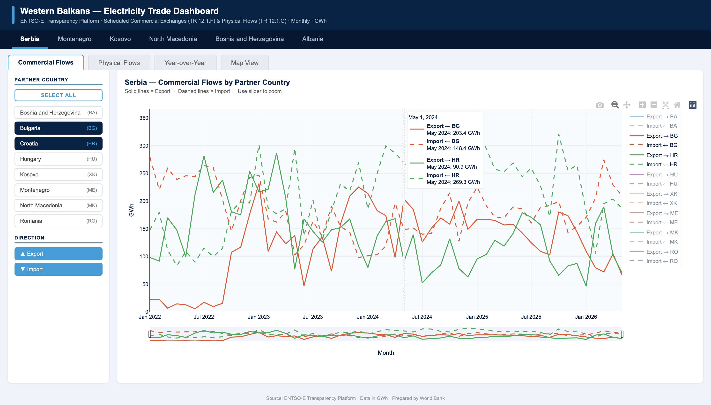
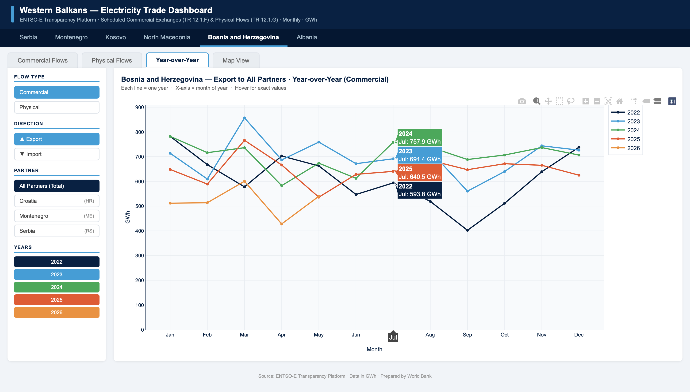
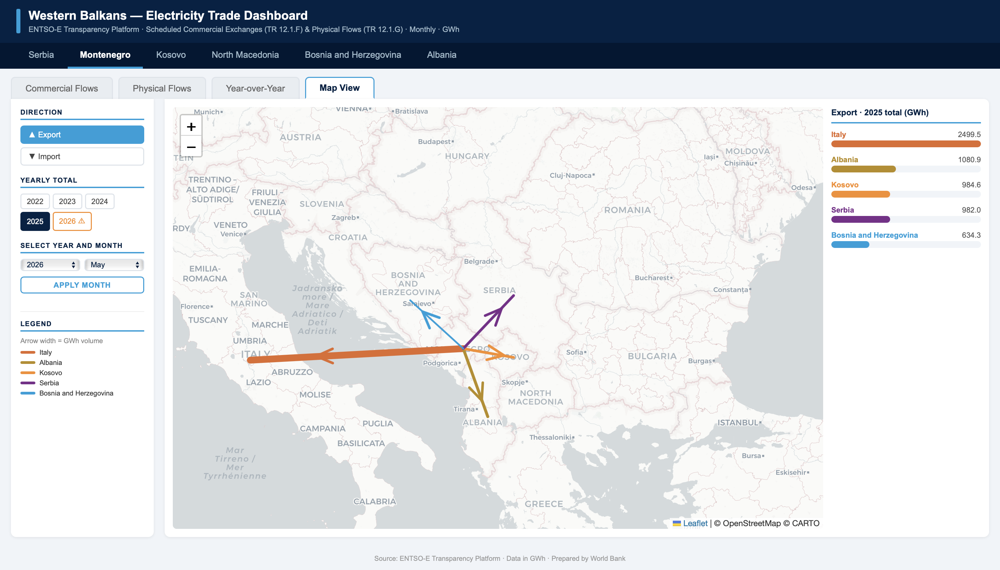

# Western Balkans Electricity Trade Dashboard

An automated data pipeline and interactive dashboard tracking cross-border electricity trade for the six Western Balkan economies (Serbia, Montenegro, Kosovo, North Macedonia, Bosnia and Herzegovina, Albania), built to support CBAM-related energy trade analysis at the World Bank.

## What it does

Cross-border electricity flow data lives on the ENTSO-E Transparency Platform, but pulling it manually for six countries and a dozen-plus trading partners is slow and error-prone. This project replaces that manual process with a single automated pipeline that:

- Pulls Scheduled Commercial Exchanges and Cross-Border Physical Flows directly from the ENTSO-E API
- Fetches only new data on each run (incremental updates, not full re-downloads)
- Validates the data (duplicate timestamps, missing hours) before saving
- Produces clean, analysis-ready Excel files with both hourly and monthly (GWh) summaries
- Generates a self-contained interactive HTML dashboard — no server required

## Dashboard

The dashboard lets a user explore the data without touching a spreadsheet: switch between countries, toggle trading partners and import/export direction, compare flows year-over-year, and view trade volumes on an interactive map with arrows scaled to flow size.

**Commercial & Physical Flows**

**Year-over-Year Comparison**

**Map View**

## Built with

`Python` · `pandas` · `entsoe-py` · `openpyxl` · `Plotly.js` · `Leaflet.js`

## Why it matters

This turned a recurring manual data-collection task into a one-click, reproducible pipeline, while making the underlying trade patterns far easier to explore and communicate than a stack of raw spreadsheets.
